#  AI Knowledge Assistant

A Retrieval-Augmented Generation (RAG) chatbot system that intelligently retrieves and processes information from documents to provide accurate, context-aware responses.

## Purpose

The Autoliv AI Knowledge Assistant is a lightweight RAG chatbot that:
- Uploads and indexes multiple document formats (PDF, Word, Excel, Markdown, HTML, CSV, JSON)
- Answers questions using intelligent document retrieval and AI
- Works on **low-resource systems** (4GB RAM, CPU-only, NO GPU required)
- Uses lightweight models optimized for efficiency
- Runs completely offline with no cloud dependencies
- Maintains conversation context across sessions

**Perfect for:**
- Laptops and older computers
- CPU-only environments
- Air-gapped/offline deployments
- Resource-constrained servers

## Prerequisites

- Python 3.8 or higher
- 4GB+ RAM
- Storage: 2GB+ for models

## Installation

### Step 1: Clone Repository
```bash
git clone https://github.com/pallavme2020/Projrct-chatbot.git
cd Projrct-chatbot
```

### Step 2: Virtual Environment & Dependencies
```bash
python -m venv venv
source venv/bin/activate  # On Windows: venv\Scripts\activate
pip install -r requirements.txt
```

### Step 3: Install Ollama

**Linux:**
```bash
curl -fsSL https://ollama.ai/install.sh | sh
```

**macOS:**
```bash
brew install ollama
```

**Windows:**
Download from [ollama.ai](https://ollama.ai) and run installer.

### Step 4: Pull Required AI Model

Your project uses **IBM Granite 4 Micro** model. Install it:

```bash
ollama pull granite4:micro-h
```

Verify it was installed:
```bash
ollama list
```

### Step 5: Start Ollama Service

**Linux/macOS:**
```bash
ollama serve
```

**Windows:**
Ollama runs as a background service automatically.

**Verify running (in another terminal):**
```bash
curl http://localhost:11434/api/tags
```

### Step 4: Prepare Your Documents
Place your documents in the `documents/` directory. Supported formats:
- PDF files
- Word documents (.docx)
- Excel spreadsheets (.xlsx)
- Markdown files (.md)
- HTML files
- CSV files
- JSON files
- Plain text files

## How to Run

1. **Start Ollama** (in one terminal):
```bash
ollama serve
```

2. **Build Database** (in another terminal):
```bash
source venv/bin/activate
python makedatabase.py
```

3. **Start Server**:
```bash
python server.py
```

4. **Open Browser**:
```
http://localhost:8000
```

5. **Ask Questions** and get AI-powered answers!

## Project Structure

```
├── server.py                    # Web server and UI handler
├── makedatabase.py              # Document processing and indexing
├── chat_v2_cleaneroutput.py    # Core RAG chat engine
├── query_classifier.py          # Query type classification
├── query_processor.py           # Query preprocessing
├── retrieval.py                 # Document retrieval logic
├── context_optimizer.py         # Response context optimization
├── session_manager.py           # Chat session management
├── logger.py                    # Logging utilities
├── requirements.txt             # Python dependencies
├── documents/                   # Input documents directory
├── db/                          # Database storage
└── #Code-Architecture-diagram/  # Architecture documentation
```

## AI Models Used

**Language Model (LLM):**
- `granite4:micro-h` - IBM Granite 4 Micro (lightweight & fast)
- Runs via Ollama locally

**Embedding Model:**
- `paraphrase-MiniLM-L3-v2` - Fast semantic embeddings (auto-downloaded)

## Project Structure

```
├── server.py                    # Web server and UI handler
├── makedatabase.py              # Document processing and indexing
├── chat_v2_cleaneroutput.py    # Core RAG chat engine
├── query_classifier.py          # Query type classification
├── query_processor.py           # Query preprocessing
├── retrieval.py                 # Document retrieval logic
├── context_optimizer.py         # Response context optimization
├── session_manager.py           # Chat session management
├── logger.py                    # Logging utilities
├── requirements.txt             # Python dependencies
├── documents/                   # Input documents directory
├── db/                          # Database storage
└── #Code-Architecture-diagram/  # Architecture documentation
```

## Quick Start

```bash
# 1. Clone repo
git clone https://github.com/pallavme2020/Projrct-chatbot.git
cd Projrct-chatbot

# 2. Setup
python -m venv venv
source venv/bin/activate
pip install -r requirements.txt

# 3. Install Ollama (Linux)
curl -fsSL https://ollama.ai/install.sh | sh

# 4. Pull model
ollama pull granite4:micro-h

# 5. Start Ollama (in new terminal)
ollama serve

# 6. Build database
python makedatabase.py

# 7. Run server
python server-3.py

# 8. Open http://localhost:8000
```

## Adding Documents

### Supported Formats
- PDF (.pdf)
- Word Documents (.docx, .doc)
- Excel Spreadsheets (.xlsx, .xls)
- Markdown (.md)
- HTML (.html, .htm)
- CSV (.csv)
- JSON (.json)
- Plain Text (.txt)

### How to Add Documents

**Step 1: Place Files in documents/ Folder**
```bash
cp your_file.pdf documents/
cp your_presentation.docx documents/
```

Or manually copy files to the `documents/` directory.

**Step 2: Rebuild Database**
```bash
python makedatabase.py
```

This processes all documents and creates searchable embeddings.

**Step 3: Start Server & Ask Questions**
```bash
python server-3.py
```

The chatbot can now answer questions about your documents!

### Example
```bash
# Add multiple documents
cp ~/Downloads/*.pdf documents/
cp ~/Documents/*.docx documents/

# Rebuild database
python makedatabase.py

# Start and use
python server.py
```

## Troubleshooting

| Issue | Solution |
|-------|----------|
| Ollama connection error | Run `ollama serve` in separate terminal |
| Model download fails | Check internet, run `ollama pull granite4:micro-h` |
| Port 8000 in use | Change port in `server.py` |
| Module not found | Run `pip install -r requirements.txt` |
| Slow first run | Building embeddings takes time on first run |
| Out of memory | Ensure 4GB+ RAM available |

## License

This project is part of the Autoliv AI initiative.

---

For more details on architecture, see `#Code-Architecture-diagram/` folder.

## Technical Specification

### 1. Document Chunking Pipeline

```mermaid
graph TD
    Start([📄 Raw Documents]) --> Load[🔧 Step 1: Load Documents<br/>LangChain Loaders]
    
    Load --> PDF[PDF - PyPDFLoader]
    Load --> DOCX[DOCX - Docx2txtLoader]
    Load --> Excel[Excel - UnstructuredExcelLoader]
    Load --> CSV[CSV - CSVLoader]
    
    PDF --> Merge[Combined Text]
    DOCX --> Merge
    Excel --> Merge
    CSV --> Merge
    
    Merge --> Split[✂️ Step 2: Sentence-Aware Splitting<br/>Using NLTK + Regex]
    
    Split --> Why1{Why Smart?}
    Why1 --> Reason1[✓ Never breaks sentences]
    Why1 --> Reason2[✓ Keeps meaning intact]
    Why1 --> Reason3[✓ Uses natural boundaries]
    
    Reason1 --> Size[📏 Chunk Size: 512 characters<br/>Optimal for embeddings]
    Reason2 --> Size
    Reason3 --> Size
    
    Size --> Overlap[⟷ Step 3: Smart Overlap<br/>50 characters]
    
    Overlap --> How{How Overlap Works?}
    How --> Ex1[Chunk 1: A B 📍C D📍]
    How --> Ex2[Chunk 2: 📍C D📍 E F]
    
    Ex1 --> Benefit1
    Ex2 --> Benefit1[No information loss<br/>between chunks]
    
    Benefit1 --> Final[✅ Step 4: Optimized Chunks]
    
    Final --> B1[✓ Better Accuracy]
    Final --> B2[✓ No Context Loss]
    Final --> B3[✓ Optimal Size]
    Final --> B4[✓ Fast Processing]
    
    B1 --> Output[(💾 Ready for Database<br/>Storage & Embedding)]
    B2 --> Output
    B3 --> Output
    B4 --> Output
    
    style Start fill:#e3f2fd
    style Load fill:#c8e6c9
    style Split fill:#fff9c4
    style Overlap fill:#f8bbd0
    style Final fill:#b39ddb
    style Output fill:#80deea
    
    style Reason1 fill:#c5e1a5
    style Reason2 fill:#c5e1a5
    style Reason3 fill:#c5e1a5
    
    style B1 fill:#90caf9
    style B2 fill:#90caf9
    style B3 fill:#90caf9
    style B4 fill:#90caf9
```



### 2. Database Storage Architecture

```mermaid
graph TD
    Start([📦 Optimized Chunks<br/>from Chunking Stage]) --> DB[🗄️ SQLite Database<br/>Lightweight & Fast]
    
    DB --> Table1[📋 Table 1: DOCS]
    DB --> Table2[🧮 Table 2: EMBEDDINGS]
    
    Table1 --> F1[ID - Primary Key]
    Table1 --> F2[Source - File Name]
    Table1 --> F3[Chunk Text - Content]
    Table1 --> F4[Chunk Index - Position]
    Table1 --> F5[Metadata - Extra Info]
    
    F1 --> Index1[🔍 Index on Source<br/>Fast file filtering]
    F2 --> Index1
    
    Table2 --> Multi[🎯 Multi-Vector Strategy<br/>3 Embeddings per Chunk]
    
    Multi --> Vec1[Vector 1: FULL TEXT<br/>Complete chunk embedding]
    Multi --> Vec2[Vector 2: FIRST SENTENCE<br/>Main idea embedding]
    Multi --> Vec3[Vector 3: KEYWORDS<br/>Key terms embedding]
    
    Vec1 --> Model[🤖 Embedding Model<br/>paraphrase-MiniLM-L3-v2]
    Vec2 --> Model
    Vec3 --> Model
    
    Model --> Why{Why 3 Vectors?}
    Why --> R1[✓ Better Precision<br/>Match different query types]
    Why --> R2[✓ Capture Main Ideas<br/>First sentence = topic]
    Why --> R3[✓ Keyword Focus<br/>Technical term matching]
    
    R1 --> Store[💾 Storage Format]
    R2 --> Store
    R3 --> Store
    
    Store --> Format1[Doc ID - Links to DOCS table]
    Store --> Format2[Embedding Type - full/first/keywords]
    Store --> Format3[Embedding BLOB - Binary format<br/>np.float32 for efficiency]
    
    Format1 --> Index2[🔍 Index on Doc ID + Type<br/>Lightning fast lookup]
    Format2 --> Index2
    
    Index2 --> Benefits[✅ Database Benefits]
    
    Benefits --> B1[⚡ Fast Retrieval<br/>Indexed searches]
    Benefits --> B2[💪 Multi-Vector Matching<br/>3x better accuracy]
    Benefits --> B3[💾 Efficient Storage<br/>Binary BLOB format]
    Benefits --> B4[🔗 Relational Links<br/>Easy to trace sources]
    
    B1 --> Output[(🎯 Ready for Search<br/>3 vectors per chunk<br/>Indexed & Optimized)]
    B2 --> Output
    B3 --> Output
    B4 --> Output
    
    output --> Tech[🔧 Technical Specs]
    Tech --> T1[Model: MiniLM-L3-v2 - 50MB]
    Tech --> T2[Vector Size: 384 dimensions]
    Tech --> T3[Format: np.float32 bytes]
    Tech --> T4[Total Vectors: 3x chunks]
    
    style Start fill:#e3f2fd
    style DB fill:#c8e6c9
    style Table1 fill:#fff9c4
    style Table2 fill:#fff9c4
    style Multi fill:#f8bbd0
    style Model fill:#b39ddb
    style Store fill:#ffccbc
    style Benefits fill:#80deea
    style Output fill:#a5d6a7
    style Tech fill:#90a4ae
    
    style Vec1 fill:#ffab91
    style Vec2 fill:#ffab91
    style Vec3 fill:#ffab91
    
    style R1 fill:#81c784
    style R2 fill:#81c784
    style R3 fill:#81c784
    
    style B1 fill:#64b5f6
    style B2 fill:#64b5f6
    style B3 fill:#64b5f6
    style B4 fill:#64b5f6
```



### 3. Query Preprocessing Pipeline

```mermaid
graph TD
    Start([💬 User Question]) --> Classify[🎯 Step 1: Query Classification]
    
    Classify --> Type{Query Type?}
    
    Type --> Casual[😊 CASUAL<br/>Greetings, thanks, etc.]
    Type --> Memory[🧠 MEMORY<br/>Previous conversation]
    Type --> Document[📄 DOCUMENT<br/>Needs database search]
    
    Casual --> FastResponse[⚡ Fast Response<br/>No preprocessing needed]
    Memory --> SessionHistory[📋 Check Session History<br/>Last 10 messages]
    
    Document --> Mode[🎨 Step 2: Mode Detection]
    
    Mode --> M1["detail - 15 docs, 400-600 words"]
    Mode --> M2["normal - 7 docs, 150-250 words"]
    Mode --> M3["short - 3 docs, 30-80 words"]
    
    M1 --> Intent
    M2 --> Intent
    M3 --> Intent[🔍 Step 3: Intent Detection]
    
    Intent --> I1[explain - Define/describe]
    Intent --> I2[compare - Differences/vs]
    Intent --> I3[list - Show me/give me]
    Intent --> I4[summarize - Overview/brief]
    Intent --> I5[howto - Steps/process]
    Intent --> I6[factual - When/where/who]
    
    I1 --> Enhance
    I2 --> Enhance
    I3 --> Enhance
    I4 --> Enhance
    I5 --> Enhance
    I6 --> Enhance[✨ Step 4: Query Enhancement]
    
    Enhance --> Sub[📝 Decompose Complex Query]
    
    Sub --> SubEx1["Original: 'What is ML and how does it work?'"]
    SubEx1 --> SubEx2["Sub-query 1: 'What is ML'"]
    SubEx1 --> SubEx3["Sub-query 2: 'how does it work'"]
    SubEx1 --> SubEx4["Sub-query 3: 'machine learning process'"]
    
    SubEx2 --> Var
    SubEx3 --> Var
    SubEx4 --> Var[🔄 Generate Search Variations]
    
    Var --> V1["Variation 1: Original query"]
    Var --> V2["Variation 2: 'what is [topic]'"]
    Var --> V3["Variation 3: 'explain [topic]'"]
    Var --> V4["Variation 4: Remove question words"]
    
    V1 --> Syn
    V2 --> Syn
    V3 --> Syn
    V4 --> Syn[📚 Synonym Expansion<br/>Using WordNet]
    
    Syn --> SynEx["'ML' → 'machine learning'<br/>'process' → 'method, procedure'<br/>'work' → 'function, operate'"]
    
    SynEx --> Hyp[📄 Hypothetical Document<br/>Create expected answer template]
    
    Hyp --> HypEx["Template: '[Topic] is a concept that<br/>refers to [description]. It involves<br/>[aspects] and is used in [context].'"]
    
    HypEx --> Entity[🏷️ Extract Entities<br/>Capitalized phrases]
    
    Entity --> EntEx["Example: 'Machine Learning'<br/>'Neural Networks', 'Data Science'"]
    
    EntEx --> KeyTerms[🔑 Extract Key Terms<br/>Remove stopwords, 4+ letters]
    
    KeyTerms --> KTEx["'machine', 'learning', 'process'<br/>'algorithm', 'training', 'model'"]
    
    KTEx --> Final[✅ Step 5: Final Query Package]
    
    Final --> Output1[Original Query]
    Final --> Output2[5-7 Sub-queries]
    Final --> Output3[5 Search Variations]
    Final --> Output4[Synonym-expanded terms]
    Final --> Output5[Hypothetical document]
    Final --> Output6[Key entities & terms]
    
    Output1 --> Ready
    Output2 --> Ready
    Output3 --> Ready
    Output4 --> Ready
    Output5 --> Ready
    Output6 --> Ready[(🎯 Ready for Retrieval<br/>7-10 enhanced queries<br/>Maximum coverage)]
    
    Ready --> Tech[🔧 Technical Tools Used]
    Tech --> T1[NLTK - Stopwords & WordNet]
    Tech --> T2[Regex - Pattern matching]
    Tech --> T3[Question Patterns - Template matching]
    Tech --> T4[Collections Counter - Frequency analysis]
    
    style Start fill:#e3f2fd
    style Classify fill:#fff9c4
    style Casual fill:#c8e6c9
    style Memory fill:#c8e6c9
    style Document fill:#c8e6c9
    style Mode fill:#f8bbd0
    style Intent fill:#ffccbc
    style Enhance fill:#b39ddb
    style Sub fill:#ce93d8
    style Var fill:#ba68c8
    style Syn fill:#ab47bc
    style Hyp fill:#9c27b0
    style Entity fill:#8e24aa
    style KeyTerms fill:#7b1fa2
    style Final fill:#80deea
    style Ready fill:#a5d6a7
    style Tech fill:#90a4ae
    
    style I1 fill:#ffab91
    style I2 fill:#ffab91
    style I3 fill:#ffab91
    style I4 fill:#ffab91
    style I5 fill:#ffab91
    style I6 fill:#ffab91
```


### 4. Retrieval and Ranking Pipeline

```mermaid
graph TD
    Start([🎯 Enhanced Queries Package<br/>From Query Preprocessing<br/>7-10 optimized queries]) --> ModeSelect{🎨 Select Retrieval Mode}
    
    ModeSelect --> Fast[⚡ FAST MODE<br/>~4 seconds<br/>3 docs needed]
    ModeSelect --> Standard[📊 STANDARD MODE<br/>~10 seconds<br/>7 docs needed]
    ModeSelect --> Thorough[🔬 THOROUGH MODE<br/>~20 seconds<br/>15 docs needed]
    
    Fast --> FastVec[Single Vector Search<br/>Main query only<br/>Top 3 results]
    FastVec --> FastOut[⚡ Fast Output]
    
    Standard --> StdStage1[📍 Stage 1: Parallel Hybrid Retrieval<br/>ThreadPoolExecutor max_workers=2]
    
    StdStage1 --> StdVec[Thread 1: Vector Search<br/>Main query → Top 20]
    StdStage1 --> StdBM25[Thread 2: BM25 Search<br/>Main query → Top 20]
    
    StdVec --> StdDB[(🗄️ Database<br/>Multi-Vector Access)]
    StdBM25 --> StdDB
    
    StdDB --> StdVec1[Query full text embeddings]
    StdDB --> StdVec2[Query first sentence embeddings]
    StdDB --> StdVec3[Query keywords embeddings]
    
    StdVec1 --> StdFusion
    StdVec2 --> StdFusion
    StdVec3 --> StdFusion["🔄 Reciprocal Rank Fusion<br/>RRF combines rankings<br/>Score = 1/(k+rank)"]
    
    StdBM25 --> StdFusion
    
    StdFusion --> StdTop[📋 Top 15 Combined Results]
    
    StdTop --> StdStage2[📍 Stage 2: Cross-Encoder Reranking<br/>ms-marco-MiniLM-L-6-v2]
    
    StdStage2 --> StdRerank[Deep semantic matching<br/>Query-document pairs<br/>Batch processing]
    
    StdRerank --> StdOut[📊 Standard Output<br/>Top 7 reranked]
    
    Thorough --> ThorStage1[📍 Stage 1: Parallel Query Enhancement<br/>ThreadPoolExecutor max_workers=3]
    
    ThorStage1 --> ThorSub[Thread 1: Sub-queries<br/>Complex decomposition]
    ThorStage1 --> ThorVar[Thread 2: Search variations<br/>Multiple phrasings]
    ThorStage1 --> ThorHyp[Thread 3: Hypothetical doc<br/>Expected answer template]
    
    ThorSub --> ThorQueries[📦 7 Query Variations<br/>Original + 5 sub + 1 hyp]
    ThorVar --> ThorQueries
    ThorHyp --> ThorQueries
    
    ThorQueries --> ThorStage2[📍 Stage 2: Parallel Multi-Source Retrieval<br/>ThreadPoolExecutor max_workers=4]
    
    ThorStage2 --> ThorLoop[For each of 5 queries:<br/>Launch 2 parallel searches]
    
    ThorLoop --> ThorV[Vector Search<br/>Top 10 per query]
    ThorLoop --> ThorB[BM25 Search<br/>Top 10 per query]
    
    ThorV --> ThorDB[(🗄️ Database<br/>All 3 Vector Types)]
    ThorB --> ThorDB
    
    ThorDB --> ThorCollect[📊 Collect All Results<br/>~100 candidate docs]
    
    ThorCollect --> ThorDedup[🔍 Deduplication<br/>Remove exact duplicates<br/>Keep unique ~50 docs]
    
    ThorDedup --> ThorStage3[📍 Stage 3: Multi-Vector Scoring<br/>Late Interaction]
    
    ThorStage3 --> ThorSentence[Split each doc into sentences<br/>Batch encode ALL sentences<br/>paraphrase-MiniLM-L3-v2]
    
    ThorSentence --> ThorMax[For each doc:<br/>Max similarity across sentences<br/>Query vs each sentence]
    
    ThorMax --> ThorTop30[📋 Top 30 by multi-vec score]
    
    ThorTop30 --> ThorStage4[📍 Stage 4: Cross-Encoder Reranking<br/>Deep semantic validation]
    
    ThorStage4 --> ThorCross[Query-doc pairs<br/>Batch prediction<br/>ms-marco-MiniLM]
    
    ThorCross --> ThorTop20[📋 Top 20 reranked]
    
    ThorTop20 --> ThorStage5[📍 Stage 5: Diversity Filter<br/>Remove near-duplicates]
    
    ThorStage5 --> ThorDiversity[Cosine similarity threshold<br/>0.85 cutoff<br/>Keep diverse docs]
    
    ThorDiversity --> ThorOut[🔬 Thorough Output<br/>Top 15 diverse + accurate]
    
    FastOut --> Final[✅ Final Ranked Documents]
    StdOut --> Final
    ThorOut --> Final
    
    Final --> Meta[📊 Metadata Attached]
    
    Meta --> M1[Source file name]
    Meta --> M2[Relevance score]
    Meta --> M3[Chunk text preview]
    Meta --> M4[Rerank score if used]
    Meta --> M5[Multi-vec score if used]
    
    M1 --> Generation
    M2 --> Generation
    M3 --> Generation
    M4 --> Generation
    M5 --> Generation[(🎯 Ready for Answer Generation<br/>Ranked, scored, diverse documents<br/>With full metadata)]
    
    Generation --> Tech[🔧 Technical Components]
    
    Tech --> T1[Embedder: paraphrase-MiniLM-L3-v2<br/>384 dims, 50MB]
    Tech --> T2[Reranker: ms-marco-MiniLM-L-6-v2<br/>Cross-encoder, 90MB]
    Tech --> T3[BM25: BM25Plus algorithm<br/>Keyword matching]
    Tech --> T4[Threading: ThreadPoolExecutor<br/>Parallel execution]
    Tech --> T5[Database: SQLite with thread lock<br/>Thread-safe operations]
    Tech --> T6[RRF: Reciprocal Rank Fusion<br/>k=60 parameter]
    
    style Start fill:#e3f2fd
    style ModeSelect fill:#fff9c4
    style Fast fill:#c8e6c9
    style Standard fill:#ffe0b2
    style Thorough fill:#f8bbd0
    
    style StdStage1 fill:#ce93d8
    style StdStage2 fill:#ba68c8
    style StdFusion fill:#ab47bc
    
    style ThorStage1 fill:#90caf9
    style ThorStage2 fill:#64b5f6
    style ThorStage3 fill:#42a5f5
    style ThorStage4 fill:#2196f3
    style ThorStage5 fill:#1e88e5
    
    style Final fill:#a5d6a7
    style Generation fill:#81c784
    style Tech fill:#90a4ae
    
    style FastOut fill:#c8e6c9
    style StdOut fill:#ffe0b2
    style ThorOut fill:#f8bbd0
    
    style StdDB fill:#fff9c4
    style ThorDB fill:#fff9c4
```


